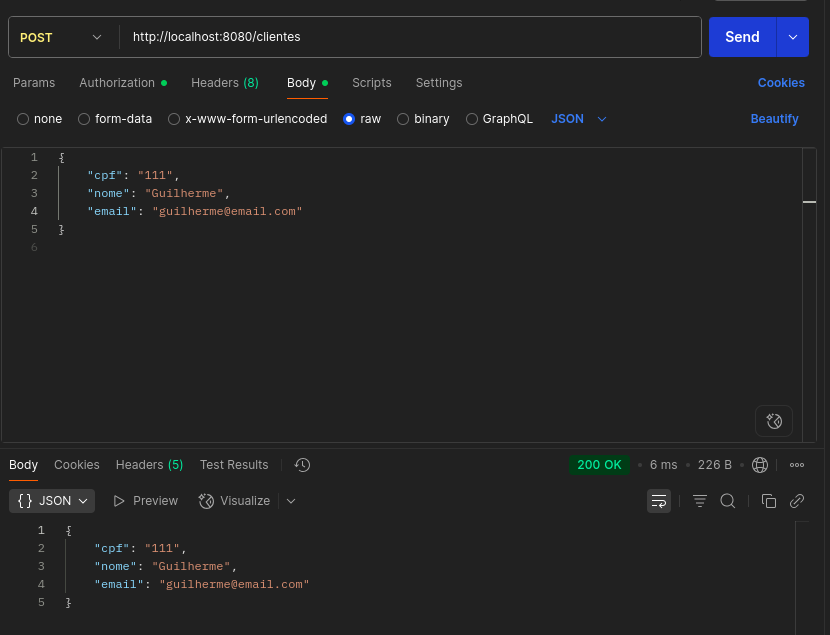
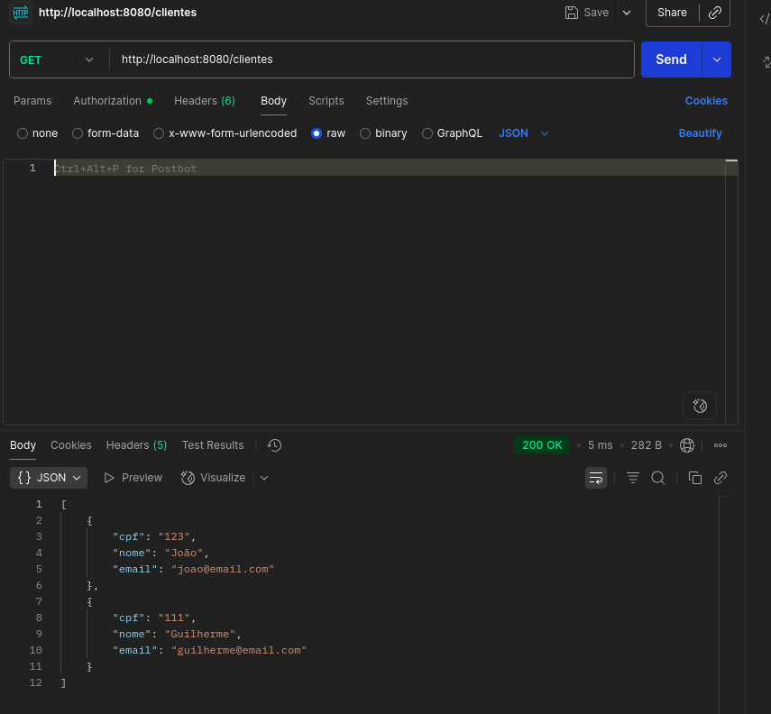
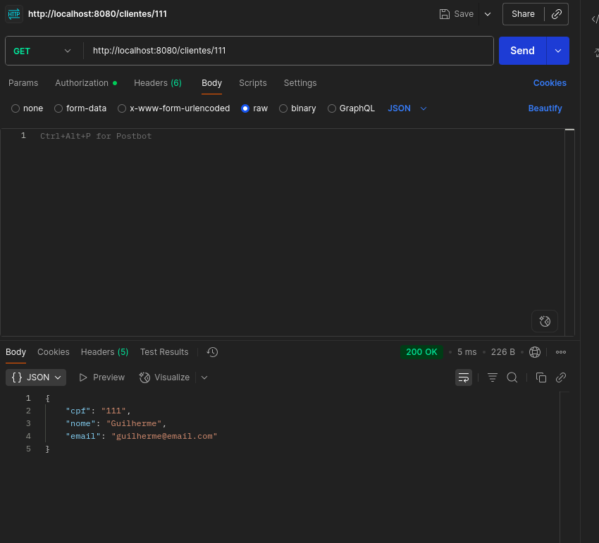
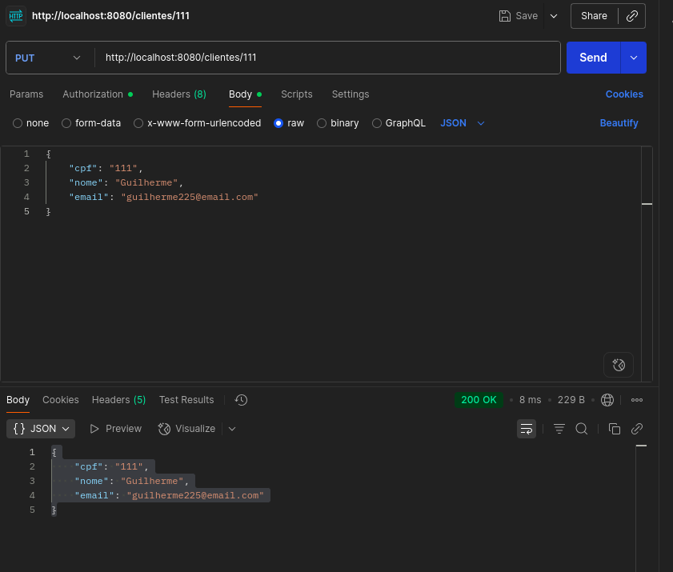
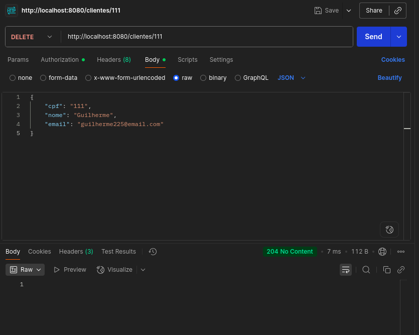

# Cliente CRUD - Spring Boot

Este projeto é um **CRUD (Create, Read, Update, Delete) de clientes** usando **Spring Boot** e armazenamento em memória.  
Ele é ideal para estudo de **REST APIs**, **Spring Boot** e arquitetura simples em camadas.

---

## 📁 Estrutura do projeto
📦 com.pratica2.clientecrud<br>
 ┣ 📂 model<br>
 ┃ ┗ 📜 Cliente.java<br>  
 ┃    ↳ Define a estrutura do cliente (atributos: cpf, nome, email).<br>
 ┣ 📂 repository<br>
 ┃ ┗ 📜 ClienteRepository.java<br>  
 ┃    ↳ Simula o "banco de dados em memória" (lista de clientes).<br>
 ┣ 📂 usecase<br>
 ┃ ┗ 📜 ClienteUseCase.java<br>  
 ┃    ↳ Camada de lógica que conecta o controller ao repositório.<br>
 ┗ 📂 controller<br>
   ┗ 📜 ClienteController.java<br>  
        ↳ Recebe as requisições HTTP e chama o usecase para executar as operações.<br>

---

## 🚀 Como rodar

### Pré-requisitos

- Java JDK 17+  
- Maven  
- IDE (VS Code, IntelliJ, Eclipse, etc.)

### Passo a passo

1. Abra o terminal na pasta raiz do projeto (onde está o `pom.xml`).  
2. Execute:

```bash
mvn clean install
mvn spring-boot:run
```
O Spring boot iniciará na porta 8080:
```bash
Tomcat started on port(s): 8080 (http)
```

## 📌 Endpoints da API (Postman)
### 1. Criar cliente (POST)

**Endpoint:** `POST /clientes`

**Descrição:** Cria um novo cliente no sistema.

#### Request
- **URL:** `http://localhost:8080/clientes`
- **Método:** `POST`
- **Content-Type:** `application/json`

#### Body
```json
{
  "cpf": "Cpf do cliente",
  "nome": "Nome do cliente",
  "email": "Email do cliente"
}
```

#### Response 
**Status:** ```200 OK```
```json
{
  "cpf": "Cpf do cliente",
  "nome": "Nome do cliente",
  "email": "Email do cliente"
}
```

#### Exemplo




### 2. Listar todos os clientes (GET)

**Endpoint:** `GET /clientes`

**Descrição:** Listar todos os clientes do sistema.

#### Request
- **URL:** `http://localhost:8080/clientes`
- **Método:** `GET`


#### Response 
**Status:** ```200 OK```
```json
[
    {
        "cpf": "Cpf do cliente1",
        "nome": "Nome do cliente1",
        "email": "Email do cliente1"
    },
    {
        "cpf": "Cpf do cliente2",
        "nome": "Nome do cliente2",
        "email": "Email do cliente2"
    }
]
```
Observação: Se não houver clientes cadastrados, retorna uma lista vazia []

#### Exemplo



### 3. Buscar cliente pelo cpf (GET)

**Endpoint:** `GET /clientes/{cpf}`

**Descrição:** Buscar um cliente pelo cpf.

#### Request
- **URL:** `http://localhost:8080/clientes{cpf}`
- **Método:** `GET`


#### Response 

##### Cliente encontrado
**Status:** ```200 OK```
```json
[
    {
        "cpf": "Cpf do cliente1",
        "nome": "Nome do cliente1",
        "email": "Email do cliente1"
    },
    {
        "cpf": "Cpf do cliente2",
        "nome": "Nome do cliente2",
        "email": "Email do cliente2"
    }
]
```

##### Cliente não encontrado
**Status:** ```404 Not Found```

#### Exemplo



### 4. Atualizar cliente pelo CPF (POST)

**Endpoint:** `PUT /clientes{cpf}`

**Descrição:** Atualiza um cliente pelo cpf.

#### Request
- **URL:** `http://localhost:8080/clientes/{cpf}`
- **Método:** `PUT`
- **Content-Type:** `application/json`

#### Body
```json
{
  "cpf": "Cpf do cliente",
  "nome": "Nome do cliente",
  "email": "Email do cliente"
}
```

#### Response 

##### Cliente atualizado com sucesso
**Status:** ```200 OK```
```json
{
  "cpf": "Cpf do cliente",
  "nome": "Nome do cliente",
  "email": "Email do cliente"
}
```

##### Cliente não encontrado
**Status:** ```404 Not Found```

#### Exemplo



### 5. Deletar cliente pelo cpf (GET)

**Endpoint:** `DELETE /clientes/{cpf}`

**Descrição:** Deleta um cliente pelo cpf.

#### Request
- **URL:** `http://localhost:8080/clientes{cpf}`
- **Método:** `DELETE`


#### Response 

##### Cliente deletado com sucesso
**Status:** ```204 No Content```

##### Cliente não encontrado
**Status:** ```404 Not Found```

#### Exemplo


## ⚠️ Observações:
- Todos os dados são armazenados em memória
- Ao reiniciar a aplicação, todos os cliente do sistema serão perdidos.

## 📅 Features:
- Salvar os dados do cliente em um banco de dados
- Criar um front-end para se comunicar com a api